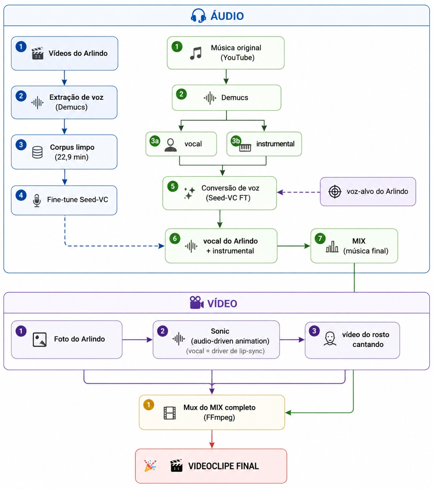

# Projeto: Cantor Virtual

Este repositório contém os módulos para análise de voz, treinamento e geração de voz artificial e avatares em vídeo do projeto de Cantor Virtual.

##  Estrutura dos Módulos

O projeto é dividido nos seguintes módulos principais:

### 1. Análise de Voz (`analise_voz`)
Nesta etapa inicial do projeto, realizamos a extração de características acústicas do áudio de origem para entender a classificação vocal e o timbre.

**Metodologia:**
O arquivo `Arlindo.wav` (mono, 44.1 kHz, ~16 minutos) foi analisado utilizando a biblioteca `librosa` em Python. O processo ocorreu em três etapas:
1. **Remoção de silêncios:** Separação por energia, com limiar de 30 dB, para analisar apenas os trechos com voz ativa.
2. **Extração de pitch:** Medição da altura da voz.
3. **Análise de timbre:** Como o arquivo é longo e consome muita memória, parte da análise de timbre foi feita numa janela representativa de ~2 minutos.

**Quais informações foram extraídas:**
A análise gira em torno de dois grupos de medidas:
* **Pitch (Altura da voz):** Calculado pelo algoritmo pYIN, que estima a frequência fundamental (F0) — quantas vezes por segundo as pregas vocais vibram. Daqui extraímos a mediana (o "centro" da voz), os percentis (até onde ela desce e sobe na fala normal) e o desvio padrão (o quanto ela varia). Essa frequência em Hz se traduz diretamente em nota musical.
* **Timbre:** A "cor" da voz independente da altura. Medimos o **centroide espectral** (onde se concentra a energia do som — quanto mais baixo, mais "quente/encorpada"; quanto mais alto, mais "brilhante/fina"); o **rolloff** (até que frequência vive a maior parte da energia); a **flatness** (mede se o som é harmônico e limpo ou ruidoso/áspero); e a **razão harmônico/percussivo** (separa a parte "cantável" da parte de ruído/respiração).

**Os números encontrados:**
* **F0 (Frequência fundamental):** A mediana ficou em ~173 Hz (nota F3), com a fala oscilando majoritariamente entre a região grave (B1/C2) e E4 nos momentos expressivos. 
* **Timbre:** O centroide espectral ficou em torno de 1.5–1.7 kHz e o rolloff em ~3.3 kHz — ambos baixos-médios. A flatness ficou muito baixa (~0.011–0.015), e a razão harmônico/percussivo foi moderada.

**Conclusões:**
Desses números saíram três conclusões práticas:
1. **Classificação Vocal:** A voz é de um **barítono**, provavelmente barítono claro/barítono-tenor. A mediana em F3 com base grave sólida e teto chegando à zona de transição é a assinatura típica dessa classificação, sendo a faixa mais versátil para canto popular.
2. **Textura e Qualidade:** A voz é quente e encorpada, não fina nem áspera. O centroide e o rolloff baixos indicam peso nos médios-graves com brilho moderado. A flatness baixíssima confirma uma voz harmônica e limpa (com pouco ruído), e a razão harmônico/percussivo moderada sugere uma leve qualidade aveludada/respirada.
3. **Viabilidade para Clonagem:** A voz é **tecnicamente ideal para clonagem**. Uma fonte limpa e estável é exatamente o que modelos (como RVC, SVC ou F5-TTS) precisam para render bem; vozes ruidosas ou instáveis fazem o modelo aprender o ruído junto. Isso justificou a recomendação de repertório na faixa C3–E4, com andamento médio, evitando músicas de tenor agudo ou muito "gritadas".

**Escolha do repertório:**
Uma vez entendida a proposta, corpo e cor da voz buscamos músicas que melhor se encaixassem dentro da faixa C3-E4. Não nos preocupamos com a nota do artista, mas sim com a nota do arranjo musical. As músicas escolhidas foram as que aparecem na apresentação final e teve nossa curadoria para isso (somente a música Wakawaka que não passou por este crivo).

### 2. Separação de Voz e Treinamento SVC (`voz_arlindo_svc`)
Este módulo converte o vocal de músicas para o timbre do Arlindo, utilizando a abordagem de **Singing Voice Conversion (SVC)** com o modelo **Seed-VC fine-tuned**.

**Principais etapas:**
1. **Separação Voz/Instrumental:** Separação das faixas utilizando o modelo Demucs (`htdemucs_ft`).
2. **Pré-processamento:** Limpeza e segmentação do corpus de voz do Arlindo para criar o dataset ideal.
3. **Treinamento (Fine-Tuning):** Treinamento do modelo Seed-VC (DiT + BigVGAN) focado no corpus do Arlindo.
4. **Pipeline Final:** Processamento automático em lote das músicas, realizando conversão, mixagem do novo vocal com o instrumental e aprimoramento da qualidade de áudio (resemble-enhance).

### 3. Modelo de TTS (`voz_gabriel_tts`)
Este módulo foca na síntese de fala (Text-to-Speech) para clonar a voz do Gabriel em narrações, utilizando o modelo **XTTS-v2 fine-tuned**.

**Principais etapas:**
1. **Transcrição de Áudio:** Uso do Whisper para gerar transcrições e criar pares exatos de áudio-texto do corpus.
2. **Preparação:** Limpeza (denoise) do corpus de voz do Gabriel e definição da referência de timbre.
3. **Treinamento:** Fine-tuning do modelo XTTS-v2 (Coqui) na voz alvo.
4. **Inferência:** Scripts de inferência para o modelo fine-tuned, incluindo suporte à narração de textos longos através da quebra em frases e concatenação.

### 4. Geração do Avatar em Vídeo (`video_avatar`)
Este módulo lida com a animação facial guiada por áudio para os clipes e narrações. Utiliza o modelo **Sonic** (Tencent, CVPR 2025) pré-treinado sobre a arquitetura do Stable Video Diffusion.

**Principais etapas:**
1. **Renderização dos Avatares:** Inferência da animação dos rostos sincronizada ao áudio (processamento unitário ou em lote por música).
2. **Composição Visual:** Geração de enquadramentos (crops) alternativos e sobreposição (pasteback) do rosto animado de volta em uma imagem ou fundo 16:9 original.
3. **Otimização de Memória:** Script específico para segmentar e concatenar renderizações de vídeos longos, contornando gargalos de memória da GPU (OOM).

---

## Resultados e Apresentações

Abaixo estão os links dos resultados do projeto:

* [Apresentação de Slides (Canva)](https://canva.link/753ngig35ztpwid)
* [Vídeo de Demonstração (YouTube)](https://youtu.be/QsHrDkdprEM)

---

## Arquitetura do Projeto

Abaixo está o diagrama ilustrando o fluxo de processamento e a arquitetura geral do Cantor Virtual:

